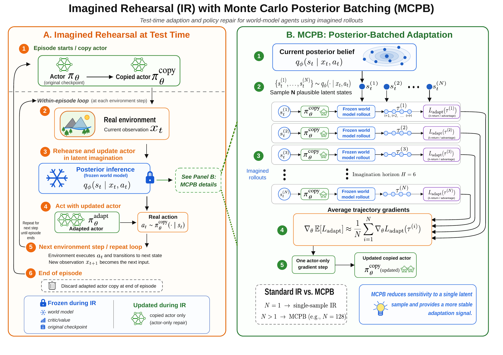

# Imagined Rehearsal

Reference implementation for **Imagined Rehearsal (IR)**, a test-time adaptation and policy-repair procedure for world-model agents.

In this codebase, the mechanism is named `eval_adapt`. In the paper, the same mechanism is referred to as **rehearsal** or **Imagined Rehearsal (IR)**.

This release is built on top of a DreamerV3 codebase, but the focus of the repository is the **IR mechanism and the paper workflow**, not a general-purpose Dreamer distribution.

## Diagram



## Attribution

This repository uses DreamerV3 as the underlying world-model agent implementation. The upstream DreamerV3 codebase provides the training stack, world model, and runtime foundation. The contribution released here is the evaluation-time IR mechanism and the experiment tooling used in the paper.

## What IR Does

At evaluation time, IR:

1. infers the current latent posterior state from real observations
2. imagines short rollouts inside the frozen world model
3. updates a temporary cloned actor using imagined data only
4. acts in the real environment with that adapted actor clone

Current implementation properties:

- IR is only active when `eval_adapt.enabled=True`
- only actor parameters are updated during IR
- the world model, reward head, continuation head, and value components remain fixed
- adapted parameters accumulate within an episode and are discarded at episode end
- training behaviour is unchanged

## Repository Scope

This repository does not ship trained checkpoints, corrupted checkpoints, or large benchmark outputs. You will need to generate those locally or provide them separately.

## Installation

Python 3.11+ is recommended.

```bash
pip install -U -r requirements.txt
```

Depending on your hardware and runtime, you may need to adjust the JAX installation line in `requirements.txt`.

## Quick Start

### 1. Train a base agent

Example training command for a DMC visual-control agent:

```bash
python dreamerv3/main.py \
  --logdir logs/dmc_walker_walk/train \
  --configs dmc_vision \
  --task dmc_walker_walk \
  --run.steps 1000000 \
  --run.envs 1 \
  --jax.platform cuda
```

This produces a checkpoint directory under `logs/dmc_walker_walk/train/` that can be used for evaluation and corruption experiments.

### 2. Evaluate without IR

```bash
python dreamerv3/main.py \
  --script eval_only \
  --logdir logs/dmc_walker_walk/eval_baseline \
  --configs dmc_vision \
  --task dmc_walker_walk \
  --run.from_checkpoint /path/to/checkpoint \
  --run.steps 50000 \
  --run.envs 1 \
  --jax.platform cuda \
  --eval_adapt.enabled False
```

### 3. Evaluate with IR

```bash
python dreamerv3/main.py \
  --script eval_only \
  --logdir logs/dmc_walker_walk/eval_ir \
  --configs dmc_vision \
  --task dmc_walker_walk \
  --run.from_checkpoint /path/to/checkpoint \
  --run.steps 50000 \
  --run.envs 1 \
  --jax.platform cuda \
  --eval_adapt.enabled True \
  --eval_adapt.steps 1 \
  --eval_adapt.imag_length 6 \
  --eval_adapt.lr 1e-4 \
  --eval_adapt.every_k 1 \
  --eval_adapt.actent 3e-4 \
  --eval_adapt.start_batch 1
```

To enable Monte Carlo posterior batching, increase `--eval_adapt.start_batch`, for example `--eval_adapt.start_batch 128` or `512`.

## Core IR Configuration

Defined in `dreamerv3/configs.yaml` under `eval_adapt`:

```yaml
eval_adapt:
  enabled: False
  steps: 3
  imag_length: 10
  lr: 1e-4
  every_k: 0
  actent: 3e-4
  start_batch: 1
```

Meaning:

- `enabled`: turn IR on or off at evaluation time
- `steps`: number of gradient updates per adaptation trigger
- `imag_length`: imagined rollout horizon
- `lr`: effective IR learning rate
- `every_k`: in-episode adaptation cadence
- `actent`: adaptation-time entropy coefficient
- `start_batch`: number of posterior start states used for Monte Carlo posterior batching

## Small User Guide

### Corrupt a checkpoint

Create actor-only corrupted checkpoint copies:

```bash
python scripts/corrupt_actor_checkpoint.py \
  --source /path/to/checkpoint \
  --out_root checkpoints/corruptions/dmc_walker_walk \
  --method zero_mask \
  --scope all \
  --strength 0.50 \
  --name zero_mask_moderate_seed0 \
  --seed 0
```

You can also use presets such as `--preset zero_mask_calibration_grid` or `--preset zero_mask_severity_triplet`.

### Run a multi-seed rehearsal sweep

Use the generic sweep wrapper to compare a corrupted baseline against IR configurations:

```bash
python scripts/eval_suite.py \
  --checkpoint /path/to/corrupted_checkpoint \
  --configs dmc_vision \
  --task dmc_walker_walk \
  --seeds 0,1,2,3,4 \
  --run_steps 5000 \
  --run_envs 1 \
  --jax_platform cuda \
  --include_baseline \
  --baseline_name corrupt_baseline \
  --adapt_steps_grid 1 \
  --adapt_imag_length_grid 6 \
  --adapt_lr_grid 1e-4 \
  --adapt_every_k_grid 1 \
  --adapt_actent_grid 3e-4 \
  --adapt_start_batch_grid 1,512
```

Outputs include:

- `runs.csv`: one row per run
- `summary_by_config.csv`: seed-aggregated summary statistics
- `comparison_vs_baseline.csv`: paired comparison against the corrupted baseline

### Run the paper benchmark wrapper

For the main paper workflow, use the dedicated benchmark wrapper:

```bash
python scripts/rehearsal_benchmark_suite.py \
  --source_checkpoint /path/to/clean_checkpoint \
  --corrupted_checkpoints checkpoints/paper_corruptions/dmc_walker_walk/zero_mask \
  --configs dmc_vision \
  --task dmc_walker_walk \
  --seeds 0,1,2,3,4 \
  --run_steps 5000 \
  --jax_platform cuda \
  --adapt_steps 1 \
  --adapt_imag_length 6 \
  --adapt_lr 1e-4 \
  --adapt_every_k 1 \
  --adapt_actent 3e-4
```

### Run Walker batch-scaling analysis

```bash
python scripts/walker_recovery_suite.py \
  --checkpoints checkpoints/paper_corruptions/dmc_walker_walk/zero_mask/moderate \
  --configs dmc_vision \
  --task dmc_walker_walk \
  --seeds 0,1,2,3,4 \
  --run_steps 5000 \
  --jax_platform cuda \
  --baseline_name corrupt_baseline \
  --adapt_steps 1 \
  --adapt_imag_length 6 \
  --adapt_lr 1e-4 \
  --adapt_every_k 1 \
  --adapt_actent 3e-4 \
  --adapt_start_batch_grid 1,2,4,8,16,32,64,128,256,512
```

### Run intra-episode trace extraction

```bash
python scripts/walker_intra_episode_trace_suite.py \
  --checkpoints checkpoints/paper_corruptions/dmc_walker_walk/zero_mask/moderate \
  --configs dmc_vision \
  --task dmc_walker_walk \
  --seeds 0,1,2,3,4 \
  --run_steps 5000 \
  --jax_platform cuda \
  --adapt_steps 1 \
  --adapt_imag_length 6 \
  --adapt_lr 1e-4 \
  --adapt_every_k 1 \
  --adapt_actent 3e-4 \
  --trace_filename trace.jsonl
```

Plot the resulting trace files with:

```bash
python scripts/plot_intra_episode_trace.py \
  --trace_glob 'eval_suite/.../trace.jsonl' \
  --out figures/intra_episode/moderate_reward_per_step.png \
  --metric reward \
  --band std
```

## Repository Layout

- `dreamerv3/`: core agent and IR implementation
- `embodied/`: runtime, environment, and evaluation loop code
- `scripts/`: corruption, benchmark, analysis, and plotting scripts

Key implementation files:

- `dreamerv3/agent.py`
- `dreamerv3/configs.yaml`
- `embodied/jax/agent.py`
- `embodied/run/eval_only.py`
- `embodied/run/train_eval.py`

## Important Notes

- IR currently assumes a single evaluation environment for adaptive evaluation.
- Real actions are sampled from the adapted actor; they are not replaced by deterministic mean actions.
- This repository does not ship the paper checkpoints or large benchmark outputs.
- `setup.py` is retained for lightweight packaging and editable installs.

## Citation

If you use this repository, please cite both the Imagined Rehearsal paper and the upstream DreamerV3 work on which this release is built.
